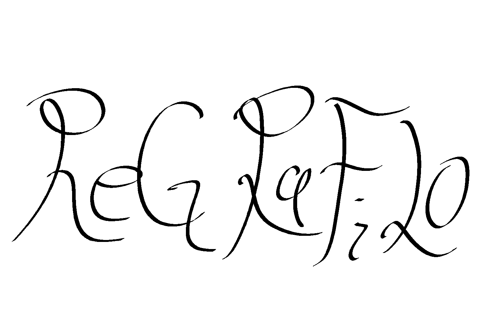
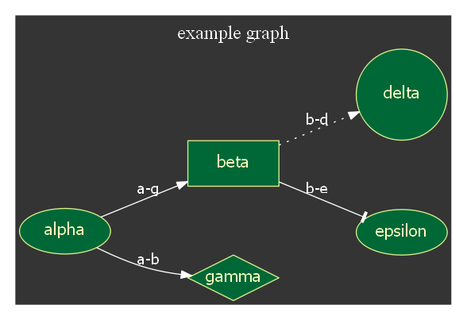

# ReGRaFiLo

この**ReGRaFiLo**は一言でいうと「Rustで書かれてたグラフを表現するフォーマットからグラフを表現するフォーマットや画像、アニメーションを生成するCLIツール」です。
Haskellerならおなじみの「ある文書構造を他の形式の文書構造に変換する[Pandoc](http://sky-y.github.io/site-pandoc-jp/users-guide/)のグラフ理論的グラフ版」だと思ってもいいかもしれません。
ちなみに読み方は「レグラフィーロ」です。エスペラント語で「再度グラフを扱う道具」的な意味です。<br/>
```cargo install regrafilo```などでインストールした後に```regrafilo input.dot output.png```のように扱います。**（予定）**

```v1.0.0```以降で対応している形式は次の通りです。
## 対応している入力形式
1. [.regrf](#.regrfのファイル形式)<br/>ReGRaFiLoの中間形式。詳細は後述。
1. [.dot](https://www.graphviz.org/doc/info/lang.html)<br/>グラフといえばおなじみのdot言語です。
1. [.gml](http://www.fim.uni-passau.de/index.php?id=17297&L=1)<br/>グラフモデリング言語（GML）形式です。階層的なAscii形式をベースとした宣言的な形式。非常に簡単な構文でネットワークデータをサポートしている。
1.  [.xgmml](http://xml.coverpages.org/xgmml-draft-xgmml-20000315.html)<br/>GMLの機能をベースとしたXML形式です。.gmlとお互いに容易に変換できます。
1. [.gexf](https://gephi.org/gexf/format/)<br/>オープンなグラフ可視化プラットフォームである[Gephi](http://oss.infoscience.co.jp/gephi/gephi.org/index.html)の内部形式で使われています。非常に変換元として優秀です。
1. [.gdf](http://graphexploration.cond.org/manual.html#_Toc116465166)<br/>CSVのデータテーブル風に頂点や辺を定義していく形式です。
1.  [.graphml](http://graphml.graphdrawing.org/specification.html)<br/>XML形式のGMLですはノードとエッジの属性、階層グラフをサポートしており、柔軟なアーキテクチャによって多くのメリットを持っている。
## 対応している出力形式
* テキスト形式
1. [.regrf](#.regrfのファイル形式)<br/> ReGRaFiLoの中間形式。詳細は後述。
1. [対応している入力形式に出ている形式](#対応している入力形式)
* 画像形式
1. [.png](https://www.w3.org/TR/PNG/)<br/>画像データを無劣化な可逆圧縮により記録するラスタ画像形式の一つ。透過も可能。
1. [.jpg](https://www.w3.org/Graphics/JPEG/jfif3.pdf)<br/>画像データを劣化する非可逆圧縮により記録するラスタ画像形式の一つ。色の透過はできない。
1. [.bmp](http://www.dragonwins.com/domains/GetTechEd/bmp/bmpfileformat.htm)<br/>最も基本的な画像形式の一つ。非圧縮画像のため画質はいいが、データ量は重い。
1. [.eps](https://www.loc.gov/preservation/digital/formats/fdd/fdd000246.shtml)<br/>PDFのようにPostScriptから派生したベクタ画像形式の一つ。そのためPDFで使われることの多い。
1. [.svg](https://www.loc.gov/preservation/digital/formats/fdd/fdd000020.shtml)<br/>XML形式で記述されるベクタ画像形式の一つ。通常HTML上で使われる上に、アニメーションにも対応している。
1. [.gif](https://www.loc.gov/preservation/digital/formats/fdd/fdd000133.shtml)<br/>画像データを可逆圧縮により記録するラスタ画像形式の一つ。色数の少ない画像データの保存に適しており、透過もできる。
* アニメーション対応 ※```v2.0.0```以降から対応予定
1. .svg<br/>画像形式だけでなくアニメーションにも対応している。
1. .gif<br/>画像形式だけでなくアニメーションにも対応している。

# 作成可能なグラフ
まず丁寧に記述された[dot言語のファイル](document/example.dot)をご覧ください。
このファイルを入力としてgraphvizのコマンド```dot -T png document/example.dot -o document/example.png```により同名のpng画像を出力出力すると次のようになります。<br/>
<br/>
そしてこのdotファイルをregrf形式で記述すると[このregrfファイル](document/example.regrf)になります。

# .regrfのファイル形式
regrf形式のファイルは先にみたように属性無しのXML風の形式で記述します。
XML同様タグを用いて宣言していきますが、XMLと違いいくつかの制限がかかっています。
その制限は
   1. 属性を利用できない
   1. タグ名はハイフンが文字列の終始にならない文字列で、半角英文字の小文字とハイフンのみからなる
   1. <hoge/>形式の中身を持たないタグは利用できない
   1. 値を持たない場合は<hoge></hoge>としなければいけない
   
となっています。

.regrfでは最初にレイアウト構造を定義し、次にグラフを定義していく形で記述していきます。
regrf形式の全体の構造は次のように表現されます。

```xml:example.regrf
<regrf>
    <meta>
        <charset>utf8</charset>
        
            <height>height</height>
            <width>width</width>
        </img-size>
    </meta>
    <layout>
        <enumerate>
            <colors>
                <color>color</color>
            </colors>
        </enumerate>
        <structure>
            <labels>
                <label>label structure</label>
            </labels>
            <graphs>
                <graph>inner graph structure</graph>
            </graphs>
            <nodes>
                <node>node structure</node>
            </nodes>
            <edges>
                <edge>edge structure</edge>
            </edges>
        </structure>
    </layout>
    <outer-graph>
        <nodes>
            <node>node body</node>
        </nodes>
        <inner-graphs>
            <inner-graph>inner graph body</inner-graph>
        </inner-graphs>
        <edges>
            <edge>edge body</edge>
        </edges>
    </outer-graph>
</regrf>
```
このように.regrfは属性を用いないXML風の形式で記述されます。
中身を見ていくと、regrfタグの下にはmeta、layout、outer-graphタグが定義されています。これらは必須です。<br/>
文法について詳しく知りたければ[こちらのファイル](document/regrf_syntax.md)をご覧ください。

